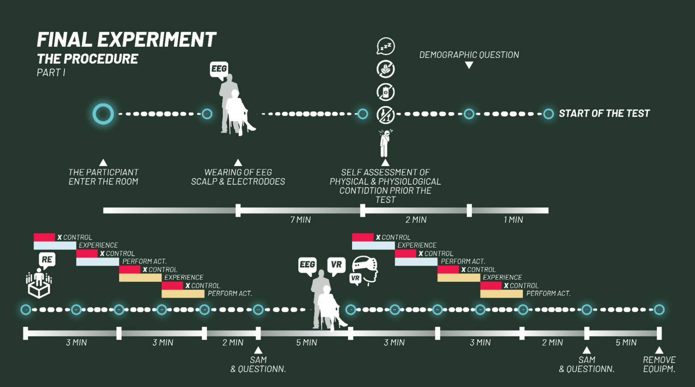

Experiment from a Master Thesis Project, Decoding Emotions through EEG in Real and Virtual Environments
EEG measurements and mEDI detections using a spectrometer and ALFA simulations.
The experiment has been carried out in 5 days, testing 15 participants

Parameters include:
- **Day**,
- **Participant**, 
- **Hour**,
- **Environment**, 
- **Light**, 
- **Scenario**, 
- **Sky Condition**,
- **Time and Date**,
- **mEDI**,
- **α ALPHA AVG**, 
- **β ALPHA AVG**, 
- **γ ALPHA AVG**,

Spectrometer used: GL SPECTIS 1.0 Touch + Flicker (mEDI was measured 120cm above the floor on a vertical plane),

VR headset used: Oculus Quest 2; itfeatures a high-resolution screen with two separate displays with a refresh rate of 90Hz,

EEG headset used: Unicorn Hybrid Black; It acquire eight electrodes of complete 8-channel EEG,, sampled with 24 bits and 250 Hz.

Columns in dataset:
- DAY: Values 1 to 5
- PARTICIPANT: 1 to 15
- HOUR: Time monitored for the different phases of the experiment
- ENVIRONMENT: RE= Real Environment; VR= Virtual Environment
- LIGHT: Condition tested: DL = Daylight / DL+EL = Electrical lighting
- SCENARIO: 
**CONT**=Control phase; 
        A brief phase before each testing condition, 30 sec long where the participants, both in the Real Environm. and in the recreated virtual environ., faced the back wall and had to stare at a black paper with a white-cross for establishing a baseline for 
        EEG signals, minimizing External Stimuli and to reduce distractions.
**EXP**=Experiencing the room; The first part of the experiment where, for a 1 minute period the EEG was recording the participant, who freely, while always remained seated, explored the room in the two condition of light (DL and DL+EL); This was done 
       in order of making an assessment of Visual Perception, visual comfort, analyzing cognitive load and attention under different lighting conditions and lastly, get the emotional and psychological responses.
**ACT**=Performing an activity;
       The second stage of the experiment consisting of participants being recorded performing a task of sorting cards numbered from 1 to 9 in increasing and decreasing order; This was done to assess the cognitive load and executive function, the attention and 
       Concentration and the motor activity, to understand the neural correlates of motor planning and execution.
- SKY CONDITION: * Lower letters: Sky type during the measurement, derived from the CIE 15 type of skies ("Spatial Distribution of Daylight" – CIE Standard General Sky, ISO 15469:2004(E)/CIE S 011/E:2003 - https://cie.co.at/publications/spatial-distribution-daylight-cie-standard-general-sky) 
** CAP Letters: An approximation of the same sky type was used in ALFA with the available sky conditions (Clear sky, Hazy, Overcast and Heavy rain); Since it is not possible to evaluate mEDI from a VR headset.
- TIME AND DATE: refers to the measurement and indication of chronological events, including the phases of the day with the transitional periods of twilight.
- mEDI: the calculated value of melanopic Equivalent Daylight Illuminance 
        *RE = detected with spectrometer; 
        **VR = measured with ALFA
- α ALPHA AVG: Average band frequencies from EEG headset for alpha waves
- β ALPHA AVG: Average band frequencies from EEG headset for beta-low waves
- γ ALPHA AVG: Average band frequencies from EEG headset for gamma waves

Note: mEDI calculations at 17:00 in the "DLl" case were not possible (due to low daylight), so mEDI values were set to 0

Dataset made by Gabriele Zoochi and supervised by Georgios Triantafyllidis in Lighting Design Lab AAU (https://www.light.aau.dk/)
